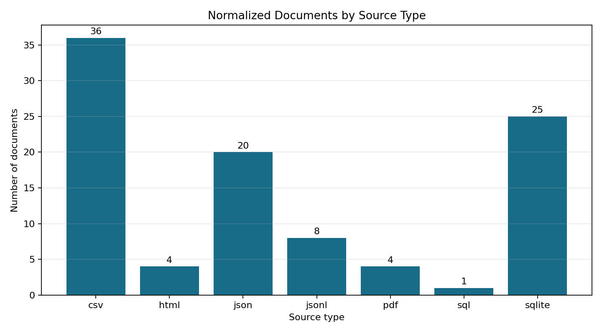
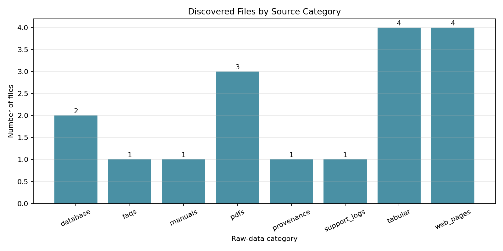

# Phase 1: Load Documents

**Project:** Hospital Patient Helpdesk Chatbot  
**Python module:** `03_ingestion/01_load_documents.py`  
**Jupyter notebook:** `13_notebooks/01_load_documents.ipynb`

## Purpose

Load PDFs, CSV files, FAQs, hospital policy files, doctor schedules, department
information, website pages, database tables, manuals, provenance records, and
de-identified support logs into a consistent document schema for the RAG
pipeline.

## Why a Normalized Ingestion Layer Is Needed

Hospital support information arrives in many formats. Later cleaning, chunking,
embedding, and retrieval stages should not need separate logic for every source
type. Phase 1 converts all supported sources into the same record structure
while preserving the original file path and structured fields.

## Input Folder Structure

The loader scans `01_data/raw/` recursively:

```text
01_data/raw/
|-- database/
|   |-- hospital_helpdesk.db
|   `-- schema.sql
|-- faqs/
|   `-- hospital_faqs.json
|-- manuals/
|   `-- patient_portal_manual.pdf
|-- pdfs/
|   |-- appointment_policy.pdf
|   |-- hospital_faqs.pdf
|   `-- insurance_guidelines.pdf
|-- provenance/
|   `-- source_manifest.csv
|-- support_logs/
|   `-- deidentified_support_logs.jsonl
|-- tabular/
|   |-- department_info.csv
|   |-- doctor_schedule.csv
|   |-- insurance_plans.csv
|   `-- service_directory.csv
`-- web_pages/
    |-- contact_and_hours.html
    |-- patient_rights.html
    |-- portal_help.html
    `-- visitor_information.html
```

## Complete Input File Inventory

| Category | Input files | Purpose |
|---|---|---|
| Database | `hospital_helpdesk.db`, `schema.sql` | Department, schedule, portal-support, and schema records |
| FAQs | `hospital_faqs.json` | Structured patient helpdesk questions and answers |
| Manuals | `patient_portal_manual.pdf` | Portal activation, access, messaging, and safety guidance |
| Policies | `appointment_policy.pdf`, `hospital_faqs.pdf`, `insurance_guidelines.pdf` | Appointment, service, billing, and insurance policies |
| Provenance | `source_manifest.csv` | Data origin and synthetic/reference status |
| Support logs | `deidentified_support_logs.jsonl` | Synthetic chat and email support examples |
| Tabular | `department_info.csv`, `doctor_schedule.csv`, `insurance_plans.csv`, `service_directory.csv` | Operational lookup tables |
| Website pages | Four local `.html` pages | Contact, visitor, rights, and portal information |

## Supported Formats

| Extension | Source type | Loading behavior |
|---|---|---|
| `.pdf` | PDF policies and manuals | Extract text with `pypdf`, falling back to `pdftotext` |
| `.csv` | Schedules and reference tables | Create one document per row |
| `.json` | FAQs and structured records | Create one document per object |
| `.jsonl` | De-identified support logs | Create one document per line |
| `.html` | Local website snapshots | Extract visible text and ignore script/style content |
| `.db` | SQLite database | Create one document per row in every user table |
| `.sql`, `.txt` | Text sources | Create one document per file |

Unsupported extensions are recorded as `skipped`. Errors from supported files
are recorded in `01_failed_documents.json` without stopping the remaining files.

## Normalized Document Schema

| Field | Description |
|---|---|
| `document_id` | Stable identifier derived from source path and record number |
| `text` | Extracted source text |
| `source_file` | Path relative to `01_data/raw` |
| `source_type` | Format such as `pdf`, `csv`, or `sqlite` |
| `category` | Parent source folder such as `faqs` or `tabular` |
| `record_index` | One-based record position within the source |
| `metadata` | Original structured fields and database table information |

## Python Module Code Sections

### 1. Schemas and result objects

`LoadedDocument`, `LoadFailure`, and `IngestionResult` define stable contracts
for normalized records, recoverable errors, and generated output paths.

### 2. HTML text extraction

`VisibleTextParser` collects visible page content while ignoring JavaScript and
CSS. This prevents non-user-facing code from entering the knowledge corpus.

### 3. Source-specific loaders

`load_csv`, `load_json`, `load_jsonl`, `load_html`, `load_text`, `load_pdf`, and
`load_sqlite` convert each format into `LoadedDocument` objects. Structured
records retain their original fields in `metadata`.

### 4. PDF fallback handling

`extract_pdf_text` uses `pypdf` when installed. If unavailable, it calls the
local `pdftotext` executable. A clear error is recorded when neither option is
available.

### 5. Discovery and fault isolation

`discover_source_files` sorts files deterministically. `load_documents` selects
loaders by extension, records skipped files, and isolates errors so one damaged
file does not abort the entire ingestion run.

### 6. Validation

`validate_documents` confirms non-empty output, required source-category
coverage, and unique source-aware document IDs.

### 7. Reporting and plots

`run_ingestion` writes JSON and CSV outputs and creates two diagnostic plots.
The manifest records file counts, normalized-record counts, source-type totals,
and every generated path.

### 8. Command-line interface

`build_parser`, `print_result`, and `main` provide repeatable terminal execution
for automation, testing, containers, and later deployment.

## Jupyter Notebook Code Sections

### 1. Project discovery

The notebook locates the shared project paths whether it is launched from the
notebook folder or repository root.

### 2. Shared module loading

The notebook imports `01_load_documents.py` dynamically. It does not maintain a
second copy of the ingestion algorithm.

### 3. Source inventory

The notebook counts files by raw-data category and extension before ingestion.
This confirms what will be processed and helps identify missing sources.

### 4. Loader previews

Representative PDF, CSV, JSON, HTML, and SQLite sources are loaded and printed
before the full run. This gives a quick human-readable extraction check.

### 5. Full ingestion

The notebook calls `run_ingestion`, prints the same summary as the CLI, and
regenerates all six Phase 1 outputs.

### 6. Validation and visualization

It verifies manifest counts, document-ID uniqueness, inventory completeness,
and failure records, then displays both diagnostic plots inline.

## Running the Python Module

```bash
python 03_ingestion/01_load_documents.py
```

Custom locations:

```bash
python 03_ingestion/01_load_documents.py \
  --raw-dir 01_data/raw \
  --processed-dir 01_data/processed
```

## Output Files

| Output | Type | Purpose |
|---|---|---|
| `01_data/processed/01_loaded_documents.json` | JSON | Normalized records used by Phase 2 |
| `01_data/processed/01_ingestion_manifest.json` | JSON | Run counts, source totals, and output inventory |
| `01_data/processed/01_source_inventory.csv` | CSV | Status, size, extension, and record count for every source file |
| `01_data/processed/01_failed_documents.json` | JSON | Non-fatal supported-file errors |
| `01_data/processed/plots/01_documents_by_source_type.png` | PNG | Normalized record volume by source format |
| `01_data/processed/plots/01_files_by_source_category.png` | PNG | Physical source-file count by raw-data folder |

## Plot Interpretation

### Normalized documents by source type

This chart shows record volume rather than file volume. One SQLite database or
CSV file may create many normalized records, while one PDF creates one Phase 1
document.



### Discovered files by source category

This chart shows physical input coverage across database, FAQ, manual, policy,
provenance, support-log, tabular, and website categories.



## Current Demonstration Result

| Metric | Result |
|---|---:|
| Files discovered | 17 |
| Files loaded | 17 |
| Unsupported files skipped | 0 |
| Files failed | 0 |
| Normalized documents | 98 |

The 98 records consist of 36 CSV, 25 SQLite, 20 JSON FAQ, 8 JSONL support-log,
4 HTML, 4 PDF, and 1 SQL record.

## Notebook and Python Module Differences

### `01_load_documents.ipynb`

- Designed for guided inspection and learning.
- Imports the shared Python module instead of duplicating loader logic.
- Inventories source categories and extensions before execution.
- Previews representative records from several source formats.
- Displays the manifest and both generated plots inline.
- Helps verify source quality before Phase 2 cleaning.

### `01_load_documents.py`

- Contains the reusable document schemas and all source loaders.
- Handles deterministic discovery, validation, errors, output writing, and plots.
- Provides a CLI for repeatable unattended execution.
- Can be imported by tests and later orchestration code.
- Avoids notebook-only display dependencies.

The notebook adds explanation and visualization. The Python module remains the
single source of truth for ingestion behavior.

## Safety and Privacy

- The bundled Northstar Community Hospital corpus is synthetic.
- Do not ingest real protected health information without authorization, access
  controls, retention policies, and privacy review.
- Unsupported files are not silently treated as hospital facts.
- Ingestion performs extraction and normalization, not diagnosis or clinical
  interpretation.
- Source paths and structured metadata remain available for later citations.

## Next Step

Use `01_data/processed/01_loaded_documents.json` as the input to
`02_clean_documents.py` or `13_notebooks/02_clean_documents.ipynb`.
