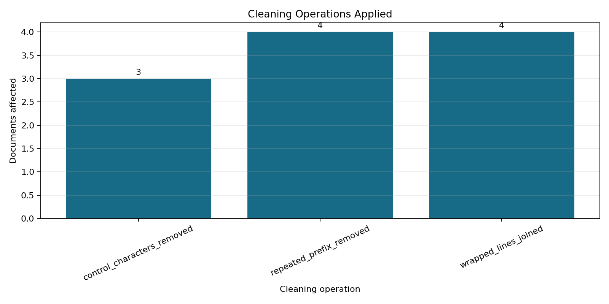
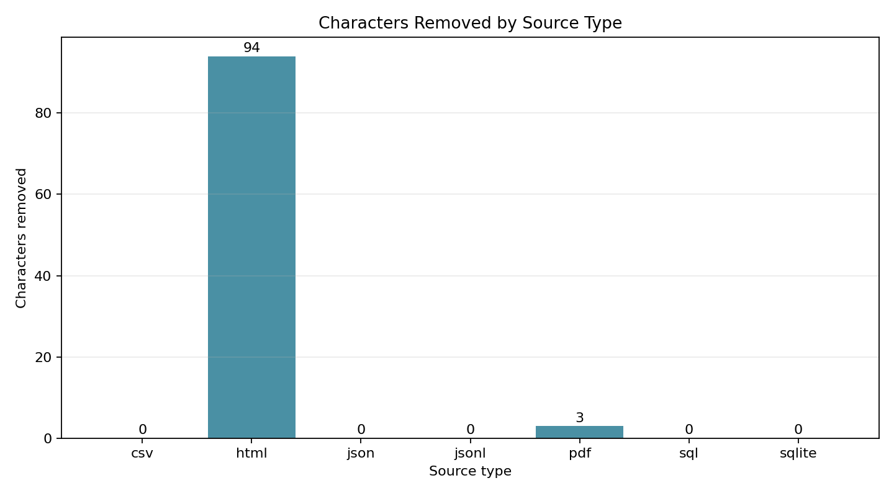

# Phase 2: Clean Documents

**Project:** Hospital Patient Helpdesk Chatbot  
**Python module:** `03_ingestion/02_clean_documents.py`  
**Jupyter notebook:** `13_notebooks/02_clean_documents.ipynb`

## Purpose

Remove unwanted control characters, extra spaces, standalone page numbers,
repeated headers, duplicated titles, PDF line-wrap noise, and other non-content
formatting while preserving source provenance and healthcare safety wording.

## Why Conservative Cleaning Matters

RAG retrieval is sensitive to noisy formatting, but aggressive cleaning can
damage phone numbers, opening hours, policy wording, emergency instructions, or
source identifiers. Phase 2 therefore applies small deterministic rules and
records every operation applied to every document.

## Input Files

| Input | Produced by | Purpose |
|---|---|---|
| `01_data/processed/01_loaded_documents.json` | Phase 1 | Normalized records from all supported source formats |

The input contains 98 records from CSV, HTML, JSON, JSONL, PDF, SQL, and SQLite
sources. Each record already includes a stable ID, source path, source type,
category, record index, and original structured metadata.

## Cleaning Rules

1. Normalize Unicode compatibility characters with NFKC.
2. Remove non-printing control characters while preserving meaningful punctuation.
3. Remove lines that contain only page-number labels such as `Page 2 of 5`.
4. Remove repeated adjacent lines and duplicated multi-word title prefixes.
5. Repair PDF layout-wrapped lines within paragraph boundaries.
6. Collapse repeated horizontal whitespace and excessive blank lines.
7. Reject only records shorter than the configured minimum after cleaning.

The cleaner does not lowercase text, stem words, remove phone punctuation,
alter document IDs, or modify original source metadata.

## Cleaned Document Schema

Each accepted record retains all Phase 1 fields and adds a `cleaning` object:

| Field | Description |
|---|---|
| `document_id` | Stable Phase 1 identifier |
| `text` | Cleaned text used for chunking |
| `source_file` | Path relative to `01_data/raw` |
| `source_type` | Format such as `pdf`, `csv`, or `sqlite` |
| `category` | Source category folder |
| `record_index` | Original record position |
| `metadata` | Unmodified structured source metadata |
| `cleaning` | Counts, applied operations, and rule-specific metrics |

The `cleaning` object records original and cleaned character counts, characters
removed, operations, removed page-number lines, duplicate-line count, and
joined PDF lines.

## Python Module Code Sections

### 1. Schemas and constants

`CleanedDocument`, `RejectedDocument`, and `CleaningResult` define stable
contracts. Regex constants centralize page-number, control-character, and
whitespace rules.

### 2. Atomic cleaning functions

Functions such as `normalize_unicode`, `remove_control_characters`,
`remove_standalone_page_numbers`, and `normalize_whitespace` each perform one
small transformation and return whether or how much text changed.

### 3. Duplicate and line-wrap handling

`remove_adjacent_duplicate_lines` handles repeated headers.
`remove_repeated_prefix` removes duplicated HTML titles. `repair_wrapped_lines`
joins PDF layout lines only when the source type is PDF.

### 4. Cleaning orchestration

`clean_text` applies rules in a deterministic order and returns cleaned text,
operation names, and rule metrics. `clean_documents` attaches the audit details
or creates a reviewable rejection record.

### 5. Input and output validation

`load_ingested_documents` verifies the Phase 1 schema.
`validate_cleaned_documents` checks non-empty text and unique document IDs.

### 6. Audit and reporting

`write_audit` creates one CSV row per input record. `run_cleaning` writes the
cleaned collection, aggregate report, rejection list, and both plots.

### 7. Diagnostic plots

`generate_plots` visualizes operation frequency and character reduction by
source type. This helps identify unexpectedly aggressive transformations.

### 8. Command-line interface

`build_parser`, `print_result`, and `main` support repeatable automated runs and
an optional minimum-text-length override.

## Jupyter Notebook Code Sections

### 1. Project and module discovery

The notebook locates the project from either the repository root or notebook
folder, then imports the shared Python module dynamically.

### 2. Rule explanation

Markdown cells explain why each cleaning rule exists and which transformations
are intentionally avoided.

### 3. Before-and-after preview

A PDF record is cleaned in memory and printed before the full run. The notebook
shows operations and metrics so the effect can be reviewed visually.

### 4. Full cleaning execution

The notebook calls `run_cleaning`, ensuring it uses exactly the same rules as
the CLI and automated workflow.

### 5. Validation and report inspection

It verifies record counts, unique IDs, non-empty text, rejection counts, and
prints the aggregate JSON report.

### 6. Plot and output display

Both PNG diagnostics are displayed inline, followed by every generated path
and file size.

## Running the Python Module

```bash
python 03_ingestion/02_clean_documents.py
```

Optional locations and threshold:

```bash
python 03_ingestion/02_clean_documents.py \
  --input 01_data/processed/01_loaded_documents.json \
  --output-dir 01_data/processed \
  --minimum-text-length 20
```

## Output Files

| Output | Type | Purpose |
|---|---|---|
| `01_data/processed/02_cleaned_documents.json` | JSON | Accepted records with cleaning metadata |
| `01_data/processed/02_cleaning_report.json` | JSON | Counts, source totals, operations, and output inventory |
| `01_data/processed/02_cleaning_audit.csv` | CSV | One audit row for every Phase 1 record |
| `01_data/processed/02_rejected_documents.json` | JSON | Records below the post-cleaning quality threshold |
| `01_data/processed/plots/02_cleaning_operations.png` | PNG | Number of documents affected by each rule |
| `01_data/processed/plots/02_characters_removed_by_source_type.png` | PNG | Character reduction by source format |

## Plot Interpretation

### Cleaning operations applied

This chart reveals which cleaning rules actually changed the corpus. A sudden
increase in an operation after new data is added can indicate a source-format
problem worth reviewing.



### Characters removed by source type

This chart shows where text reduction occurred. HTML contains duplicated page
titles, while PDF extraction contributes control characters and wrapped lines.
Structured sources should generally require little or no character removal.



## Current Demonstration Result

| Metric | Result |
|---|---:|
| Input documents | 98 |
| Cleaned documents | 98 |
| Rejected documents | 0 |
| Characters removed | 97 |

Three PDF records required control-character removal, four HTML records had
duplicated title prefixes removed, and four PDF records required line-wrap
repair. All source types and document identifiers were retained.

## Notebook and Python Module Differences

### `02_clean_documents.ipynb`

- Designed for interactive review and learning.
- Imports the shared Python implementation instead of duplicating rules.
- Explains each transformation and shows a before-and-after PDF preview.
- Prints the report and displays both diagnostic plots inline.
- Helps confirm cleaning quality before Phase 3 chunking.

### `02_clean_documents.py`

- Contains reusable schemas and deterministic cleaning functions.
- Handles validation, rejection tracking, audit CSV, reports, and plots.
- Provides command-line arguments for unattended execution.
- Can be imported by tests, scheduled jobs, and later pipeline stages.
- Avoids notebook-only display dependencies.

The notebook adds explanation and inspection. The Python module remains the
single source of truth for cleaning behavior.

## Quality, Safety, and Privacy

- Accepted documents retain stable IDs and source provenance.
- Rejected documents remain visible for review rather than being deleted.
- Cleaning performs no diagnosis, treatment recommendation, or clinical
  interpretation.
- Emergency and medication-safety wording is preserved.
- Real protected health information requires approved privacy, retention,
  access-control, and audit procedures.
- The bundled Northstar Community Hospital dataset is synthetic.

## Next Step

Use `01_data/processed/02_cleaned_documents.json` as the input to
`03_chunk_documents.py` or `13_notebooks/03_chunk_documents.ipynb`.
