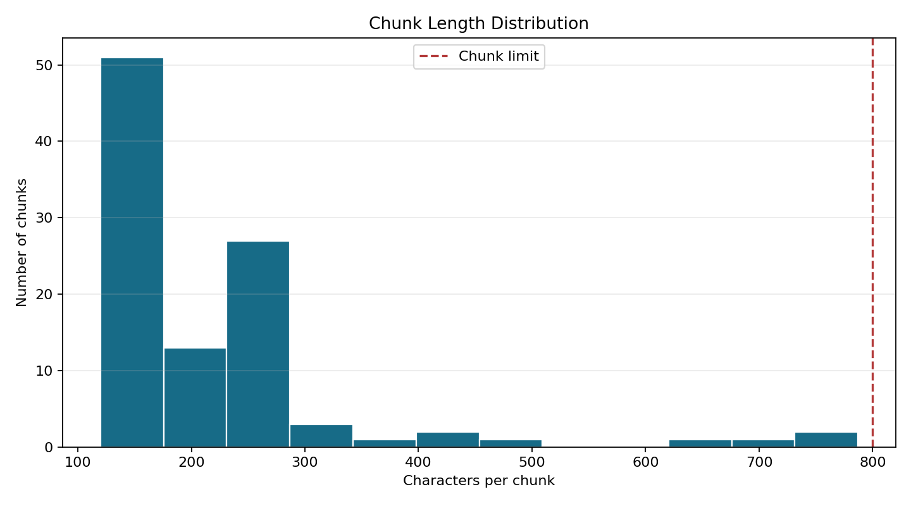
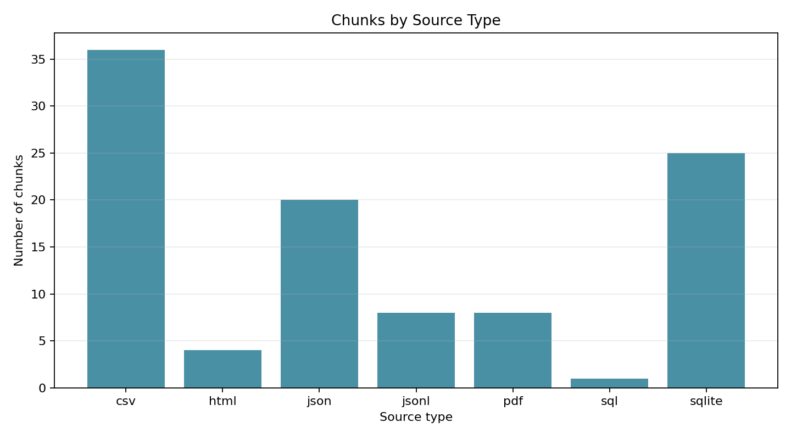

# Phase 3: Chunk Documents

**Project:** Hospital Patient Helpdesk Chatbot  
**Python module:** `03_ingestion/03_chunk_documents.py`  
**Jupyter notebook:** `13_notebooks/03_chunk_documents.ipynb`

## Purpose

Split long hospital documents into smaller, overlapping chunks for RAG search.
Each chunk remains connected to its source document, exact character offsets,
cleaning history, and structured metadata.

## Why Chunking Is Required

Embedding and retrieval systems work better with focused passages than with
entire long documents. A good chunk should contain enough context to answer a
question while avoiding unrelated material that can reduce retrieval precision.

Overlap repeats a small amount of neighboring text so a fact located near a
boundary is still represented completely in at least one chunk.

## Input Files

### Required input

| File | Produced by | Purpose |
|---|---|---|
| `01_data/processed/02_cleaned_documents.json` | Phase 2 | Cleaned documents with source and cleaning metadata |

### Configuration reference

| File | Setting used |
|---|---|
| `02_config/config.yaml` | `chunk_size: 800` and `chunk_overlap: 120` |

The Python CLI also exposes these values as command-line arguments, allowing
controlled experiments without editing code.

## Chunking Configuration

| Parameter | Value | Meaning |
|---|---:|---|
| Chunk size | 800 characters | Maximum text length for one chunk |
| Chunk overlap | 120 characters | Approximate repeated context between neighboring chunks |
| Minimum chunk size | 80 characters | Quality threshold for fragments when a document creates multiple chunks |

Character-based sizing is deterministic and independent of the future
embedding provider. Token-aware limits can be added when a specific embedding
model and tokenizer are selected.

## Boundary Selection Strategy

When a document exceeds the maximum size, the chunker searches backward from
the hard limit and chooses the strongest available boundary:

1. Paragraph break.
2. Sentence ending.
3. Semicolon or colon boundary.
4. Whitespace boundary.
5. Hard character limit when no suitable boundary exists.

The next chunk starts near the previous ending minus the overlap. Leading and
trailing whitespace is excluded, and exact offsets refer to the original
cleaned text.

## Chunk Schema

Each object in `03_text_chunks.json` contains:

| Field | Description |
|---|---|
| `chunk_id` | Unique identifier formed from the document ID and chunk number |
| `document_id` | Stable Phase 1 and Phase 2 document identifier |
| `text` | Retrieval-ready chunk text |
| `source_file` | Original path relative to `01_data/raw` |
| `source_type` | PDF, CSV, JSON, HTML, SQLite, or another supported format |
| `category` | Source category such as `pdfs`, `faqs`, or `tabular` |
| `record_index` | Original source-record position |
| `chunk_index` | One-based chunk position within the document |
| `chunk_count` | Total accepted chunks for the document |
| `character_start` | Inclusive source-text start offset |
| `character_end` | Exclusive source-text end offset |
| `character_count` | Length of the chunk text |
| `metadata` | Original metadata plus Phase 2 cleaning details |

## Code Section Guide

### 1. Configuration validation

`ChunkingConfig` confirms that sizes are positive, overlap is smaller than the
chunk limit, and the minimum fragment size is valid. This catches unsafe
parameter combinations before files are processed.

### 2. Input loading

`load_cleaned_documents` verifies that Phase 2 output is a JSON list and that
every record contains the expected provenance and cleaning fields.

### 3. Boundary discovery

`find_preferred_end` searches the current window for the best paragraph,
sentence, punctuation, or whitespace boundary. This keeps chunks readable and
reduces mid-sentence splitting.

### 4. Text splitting

`split_text` moves through the cleaned text, applies the configured overlap,
trims only boundary whitespace, and returns text with exact start and end
offsets.

### 5. Metadata attachment

`chunk_document` creates stable chunk IDs and copies source, category, record,
structured metadata, and cleaning audit information into every chunk.

### 6. Validation

`validate_chunks` checks unique IDs, non-empty text, maximum length, valid
offsets, and complete coverage of every input document.

### 7. Reporting and plots

`run_chunking` writes the chunk collection, aggregate report, per-document
audit, rejected fragments, and two PNG diagnostic plots.

## Running the Python Module

From the project directory:

```bash
python 03_ingestion/03_chunk_documents.py
```

Custom settings:

```bash
python 03_ingestion/03_chunk_documents.py \
  --input 01_data/processed/02_cleaned_documents.json \
  --output-dir 01_data/processed \
  --chunk-size 800 \
  --chunk-overlap 120 \
  --minimum-chunk-size 80
```

## Output Files

| Output | Type | Purpose |
|---|---|---|
| `01_data/processed/03_text_chunks.json` | JSON | Retrieval-ready chunks with provenance and offsets |
| `01_data/processed/03_chunking_report.json` | JSON | Configuration, counts, length statistics, and source totals |
| `01_data/processed/03_chunking_audit.csv` | CSV | One quality-control row per input document |
| `01_data/processed/03_rejected_chunks.json` | JSON | Fragments excluded by the minimum-size rule |
| `01_data/processed/plots/03_chunk_length_distribution.png` | PNG | Distribution of chunk character lengths |
| `01_data/processed/plots/03_chunks_by_source_type.png` | PNG | Number of chunks contributed by each source format |

## Plot Interpretation

### Chunk length distribution

This histogram verifies that no chunk exceeds the configured 800-character
limit. It also makes unexpectedly small fragments visible, which can indicate
poor boundaries or an unsuitable minimum size.



### Chunks by source type

This bar chart shows the composition of the retrieval corpus. It helps detect
whether one format dominates the vector index or whether an expected source
type is missing.



## Current Demonstration Result

Using the synthetic Northstar Community Hospital corpus:

| Metric | Result |
|---|---:|
| Input documents | 98 |
| Chunks created | 102 |
| Rejected chunks | 0 |
| Documents split into multiple chunks | 4 |
| Minimum chunk length | 120 characters |
| Maximum chunk length | 787 characters |
| Mean chunk length | 222.25 characters |
| Median chunk length | 174 characters |
| 95th percentile | 401.90 characters |

The four long PDF documents were split into two chunks each. The other 94
records remained single chunks. The resulting source composition is 36 CSV, 25
SQLite, 20 JSON, 8 JSONL, 8 PDF, 4 HTML, and 1 SQL chunk.

## Notebook and Python Module Differences

### `03_chunk_documents.ipynb`

- Designed for learning, inspection, and experimentation.
- Imports and uses the shared Python module instead of duplicating logic.
- Explains parameter choices and every workflow stage.
- Shows a before-and-after chunk preview for the longest document.
- Prints the full report and displays both plots inline.
- Useful for validating settings before adopting them in automation.

### `03_chunk_documents.py`

- Contains the reusable chunking, validation, reporting, and plotting logic.
- Provides dataclasses and functions that tests or later pipeline stages can import.
- Supports command-line arguments for repeatable automated execution.
- Produces concise terminal output without notebook-only display code.
- Suitable for scheduled jobs, containers, CI pipelines, and deployment.

Keeping business logic in the Python module prevents the notebook and
production workflow from implementing different chunking rules.

## Quality and Safety Controls

- Chunk IDs are unique and source-aware.
- No chunk exceeds the configured maximum length.
- Every input document appears in the final chunk collection.
- Exact character offsets support source verification and debugging.
- Rejected fragments are reported rather than silently discarded.
- Chunking does not generate, diagnose, summarize, or reinterpret medical content.
- Emergency and dosage-safety wording remains attached to its source and may be
  repeated through overlap by design.

## Next Step

Use `01_data/processed/03_text_chunks.json` as the input to
`04_create_metadata.py` or `13_notebooks/04_create_metadata.ipynb`.
