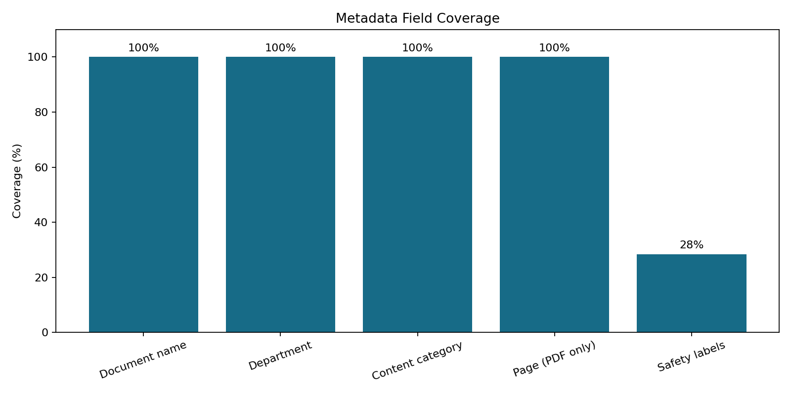
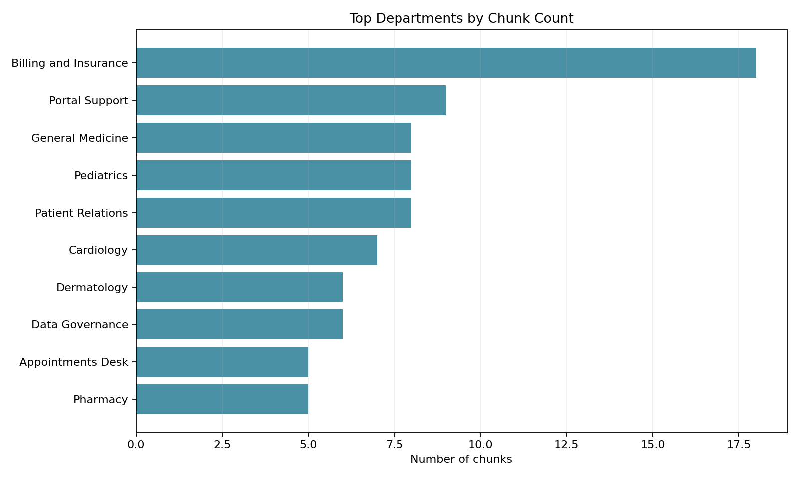

# Phase 4: Create Metadata

**Project:** Hospital Patient Helpdesk Chatbot  
**Python module:** `03_ingestion/04_create_metadata.py`  
**Jupyter notebook:** `13_notebooks/04_create_metadata.ipynb`

## Purpose

Attach reliable retrieval metadata to every Phase 3 chunk, including document
name, title, department, content category, page range, source file, derivation
method, confidence, safety labels, and provenance fields.

## Why Metadata Matters

RAG retrieval uses metadata to filter, cite, explain, and evaluate results. A
patient question can be restricted to an operational department or content
category, while page and source fields allow an answer to cite its evidence.

Metadata must also distinguish source-authored facts from inferred labels. This
phase records both the derivation method and confidence for inferred fields.

## Input Files

| Input | Required | Purpose |
|---|---|---|
| `01_data/processed/03_text_chunks.json` | Yes | Phase 3 chunks and inherited provenance |
| `01_data/raw/pdfs/*.pdf` | For PDF pages | Original policy PDFs used for page matching |
| `01_data/raw/manuals/*.pdf` | For PDF pages | Original manual PDFs used for page matching |

Structured metadata already inside each chunk is reused before any keyword
inference is attempted.

## Metadata Schema

| Field | Description |
|---|---|
| `chunk_id` | Unique Phase 3 chunk identifier |
| `document_id` | Stable source-record identifier |
| `document_name` | Original file name including extension |
| `document_title` | Readable title selected from source fields or file name |
| `department` | Operational department or service area |
| `department_method` | Explicit field, source rule, keyword inference, or default |
| `department_confidence` | Confidence from `0.0` to `1.0` |
| `content_category` | Retrieval category such as appointments or insurance |
| `category_method` | How the category was obtained |
| `category_confidence` | Confidence from `0.0` to `1.0` |
| `source_file` | Path relative to `01_data/raw` |
| `source_type` | Source format such as PDF, CSV, or SQLite |
| `source_group` | Raw-data grouping such as `pdfs` or `faqs` |
| `page_start`, `page_end` | Matched PDF page range; null for non-PDF sources |
| `page_method` | `pdf_text_overlap`, `not_applicable`, or `unavailable` |
| `chunk_index`, `chunk_count` | Chunk position within its source document |
| `character_start`, `character_end` | Exact offsets in cleaned source text |
| `safety_labels` | Non-clinical routing labels such as emergency or privacy |
| `synthetic_data` | Marks the bundled demonstration corpus |
| `metadata_version` | Version of the metadata contract |

## Derivation Priority

1. Use explicit structured fields such as `department`, `department_name`, and
   FAQ or support-log `category`.
2. Apply deterministic source rules for SQL schemas and known database tables.
3. Infer remaining labels with transparent keyword maps.
4. Record the method and confidence for every department and category value.
5. Use `general` only if no explicit value or known keyword is available.

## PDF Page Matching

Phase 1 loaded each PDF as one document, so page numbers were not directly
stored in the chunks. Phase 4 extracts the original PDF page texts, normalizes
their words, and compares each PDF chunk with every page.

Pages containing at least 15 percent of the chunk's informative words are
included in the page range. When no page reaches that threshold, the strongest
non-zero page match is used. The method is stored as `pdf_text_overlap`, making
the derived nature of the page reference explicit.

## Code Section Guide

### 1. Input validation

`load_chunks` confirms that the input is a JSON list and that each chunk has
the Phase 3 fields needed for traceability.

### 2. Human-readable document identity

`humanize_name` and `document_title` select useful titles from structured
fields, source headings, or file names.

### 3. Department and category derivation

`derive_department` and `derive_content_category` prefer explicit fields,
apply source rules, then use auditable keyword matching. The selected method
and confidence are written with the result.

### 4. Safety labels

`derive_safety_labels` identifies source text related to emergency routing,
medical-advice restrictions, and privacy. These are retrieval/evaluation labels,
not diagnoses or clinical risk scores.

### 5. PDF page references

`build_pdf_page_index` extracts page text once per PDF. `derive_page_range`
matches each PDF chunk to one or more pages by normalized word overlap.

### 6. Metadata records and enrichment

`create_metadata_records` builds one metadata object per chunk.
`04_enriched_chunks.json` combines the original chunk with its new
`retrieval_metadata` object for embedding and vector-store stages.

### 7. Validation, reporting, and plots

`validate_metadata` checks one-to-one chunk coverage and unique IDs.
`run_metadata_creation` writes all artifacts and creates field-coverage and
department-distribution plots.

## Running the Python Module

```bash
python 03_ingestion/04_create_metadata.py
```

Custom locations:

```bash
python 03_ingestion/04_create_metadata.py \
  --input 01_data/processed/03_text_chunks.json \
  --raw-dir 01_data/raw \
  --output-dir 01_data/processed
```

## Output Files

| Output | Type | Purpose |
|---|---|---|
| `01_data/processed/04_metadata.json` | JSON | One metadata record per chunk |
| `01_data/processed/04_enriched_chunks.json` | JSON | Chunk text and retrieval metadata together |
| `01_data/processed/04_metadata_report.json` | JSON | Coverage, counts, labels, and output inventory |
| `01_data/processed/04_metadata_audit.csv` | CSV | Human-readable derivation audit for every chunk |
| `01_data/processed/04_unresolved_metadata.json` | JSON | Records requiring manual metadata review |
| `01_data/processed/plots/04_metadata_field_coverage.png` | PNG | Coverage percentage for important fields |
| `01_data/processed/plots/04_chunks_by_department.png` | PNG | Top departments by chunk count |

## Diagnostic Plots

### Metadata field coverage

The coverage plot verifies document-name, department, category, PDF-page, and
safety-label population. Safety labels are expected only where relevant, so
their lower percentage is informational rather than a failure.



### Chunks by department

The department chart shows which operational areas dominate the retrieval
corpus and can reveal missing or overrepresented departments.



## Current Demonstration Result

| Metric | Result |
|---|---:|
| Input chunks | 102 |
| Metadata records | 102 |
| Records requiring review | 0 |
| Department coverage | 100% |
| Content-category coverage | 100% |
| PDF page coverage | 100% |

The output includes explicit, source-rule, and keyword-derived values. Each
derived value retains its method and confidence so later evaluation can filter
or audit inferred metadata.

## Notebook and Python Module Differences

### `04_create_metadata.ipynb`

- Provides a guided, interactive Phase 4 walkthrough.
- Imports the Python module so it uses the production metadata rules.
- Previews representative metadata records and derivation methods.
- Displays the complete report and both diagnostic plots inline.
- Supports human review before metadata is embedded or indexed.

### `04_create_metadata.py`

- Contains reusable schema, derivation, page matching, validation, and plotting logic.
- Provides a command-line interface for automated runs.
- Writes deterministic artifacts for downstream embedding and vector storage.
- Avoids notebook-only display dependencies in production execution.
- Can be imported by tests, scheduled jobs, and later pipeline stages.

The notebook adds explanation and visualization; the Python module remains the
single source of truth for metadata behavior.

## Safety and Privacy

- Inferred metadata is labeled with its method and confidence.
- Safety labels support retrieval routing and testing only; they do not diagnose
  conditions or estimate clinical risk.
- Source text, chunk IDs, offsets, and provenance are preserved unchanged.
- The bundled dataset is synthetic. Real patient data requires approved access,
  privacy, retention, and audit controls.

## Next Step

Use `01_data/processed/04_enriched_chunks.json` as the input to
`05_create_embeddings.py` or `13_notebooks/05_create_embeddings.ipynb`.
