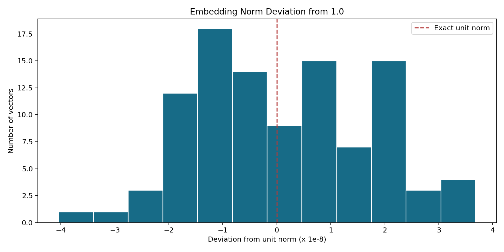
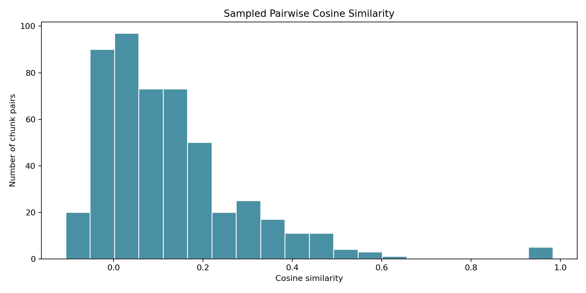

# Phase 5: Create Embeddings

**Project:** Hospital Patient Helpdesk Chatbot  
**Python module:** `04_embeddings/05_create_embeddings.py`  
**Jupyter notebook:** `13_notebooks/05_create_embeddings.ipynb`

## Purpose

Convert every approved Phase 4 text chunk into a fixed-length numeric vector
for semantic retrieval. Each vector remains linked to its chunk ID, source,
department, category, model, dimension, and text checksum.

## Privacy-Conscious Development Provider

The default `local-hashing-embedding-v1` provider is deterministic and offline.
It does not require an API key, model download, or transmission of hospital text.
It is intended as a reproducible development baseline rather than a claim of
state-of-the-art clinical language understanding.

The provider:

1. normalizes case and whitespace;
2. extracts word and adjacent-word features;
3. maps features into 384 positions with stable BLAKE2 hashing;
4. applies signed, log-scaled frequency weights; and
5. L2-normalizes every vector for cosine similarity.

A production transformer or hosted embedding provider can later replace this
implementation while preserving the same artifact schema.

## Input File

| Input | Required | Purpose |
|---|---|---|
| `01_data/processed/04_enriched_chunks.json` | Yes | Phase 4 text chunks with retrieval metadata and provenance |

Each record must include `chunk_id`, `document_id`, `text`, `source_file`,
`source_type`, and `retrieval_metadata`.

## Embedding Record Schema

| Field | Description |
|---|---|
| `chunk_id` | Stable identifier used to join the vector to its source chunk |
| `document_id` | Source-document or source-record identifier |
| `source_file`, `source_type` | Original provenance |
| `department` | Phase 4 operational department label |
| `content_category` | Phase 4 retrieval category |
| `model` | Embedding implementation identifier |
| `dimension` | Number of vector values; 384 by default |
| `text_sha256` | Checksum of the exact embedded text |
| `vector_norm` | L2 norm after normalization; approximately 1.0 |
| `embedding` | Numeric vector used by the Phase 6 vector index |

## Code Section Guide

### 0. Notebook project discovery

The notebook's `find_project_root` helper searches the current directory, its
parents, and a `hospital_patient_helpdesk_chatbot` child at each level. A
candidate is accepted only when both `04_embeddings/05_create_embeddings.py`
and `01_data/processed/04_enriched_chunks.json` exist. This allows Jupyter to
start from the workspace root, project root, or `13_notebooks` without creating
an incorrect duplicated project path.

### 1. Configuration and input validation

`EmbeddingConfig` validates vector dimension, batch size, and bigram behavior.
`load_enriched_chunks` verifies the Phase 4 schema before embedding begins.

### 2. Text feature extraction

`normalize_text` standardizes case and whitespace for vector generation without
changing the stored source text. `text_features` extracts word and optional
adjacent-word features.

### 3. Stable feature hashing

`feature_location` uses BLAKE2 bytes to choose a stable vector position and
sign. Unlike Python's built-in `hash`, the result is reproducible across runs.

### 4. Vector construction and normalization

`embed_text` applies log-scaled feature frequencies and `l2_normalize` converts
the result to unit length. Unit vectors support efficient cosine similarity.

### 5. Batching and failure isolation

`batched` limits the number of records processed together.
`create_embedding_records` preserves provenance, creates checksums, writes audit
details, and captures invalid records without hiding their IDs.

### 6. Validation

`validate_embeddings` checks unique IDs, exact Phase 4 coverage, dimensions,
finite numeric values, and unit norms before artifacts are accepted.

### 7. Diagnostics and reporting

`sampled_similarities` measures a deterministic subset of vector pairs.
`generate_plots` visualizes vector norms and pairwise cosine similarities.
`run_embedding_creation` coordinates all steps and writes the final report.

## Running the Python Module

```bash
python 04_embeddings/05_create_embeddings.py
```

Custom settings:

```bash
python 04_embeddings/05_create_embeddings.py \
  --input 01_data/processed/04_enriched_chunks.json \
  --output-dir 01_data/processed \
  --dimension 384 \
  --batch-size 32
```

Use `--no-bigrams` only when a unigram-only baseline is intentionally required.

## Output Files

| Output | Type | Purpose |
|---|---|---|
| `01_data/processed/05_embeddings.json` | JSON | Complete vectors and retrieval provenance |
| `01_data/processed/05_embedding_manifest.json` | JSON | Lightweight records without vector arrays |
| `01_data/processed/05_embedding_report.json` | JSON | Configuration, counts, norms, similarities, and output inventory |
| `01_data/processed/05_embedding_audit.csv` | CSV | Per-chunk batch, feature, dimension, norm, and checksum audit |
| `01_data/processed/05_failed_embeddings.json` | JSON | Records that could not be embedded |
| `01_data/processed/plots/05_embedding_norm_distribution.png` | PNG | Distribution of vector L2 norms |
| `01_data/processed/plots/05_cosine_similarity_distribution.png` | PNG | Distribution of sampled pair similarities |

## Diagnostic Plots

### Embedding norm distribution

Every accepted vector should have an L2 norm very close to 1.0. The horizontal
axis shows tiny deviations in units of `1e-8`; a wide or off-center spread would
indicate a normalization or serialization problem.



### Cosine similarity distribution

This plot summarizes 500 deterministic chunk pairs. It is a health check for
collapsed or identical vectors, not a retrieval-quality evaluation. Phase 17
will measure whether relevant chunks are actually retrieved for test questions.



## Current Demonstration Result

| Metric | Result |
|---|---:|
| Input chunks | 102 |
| Embeddings created | 102 |
| Failed embeddings | 0 |
| Vector dimension | 384 |
| Model | `local-hashing-embedding-v1` |
| Vector norm | Approximately 1.0 |

## Notebook and Python Module Differences

### `05_create_embeddings.ipynb`

- Provides a guided Phase 5 walkthrough.
- Resolves the project root safely from common Jupyter working directories.
- Previews the input schema and one vector before the full run.
- Imports and executes the production module.
- Displays the report and both diagnostic plots inline.
- Uses assertions to support interactive quality review.

### `05_create_embeddings.py`

- Contains the reusable embedding implementation and schema.
- Provides deterministic tokenization, feature hashing, and normalization.
- Handles batching, checksums, validation, failures, reports, and plots.
- Exposes a command-line interface for automated pipeline execution.
- Can be imported by notebooks, tests, scheduled jobs, and Phase 6.

The notebook explains and inspects; the Python module remains the single source
of truth.

## Safety and Limitations

- The local provider keeps source text on the machine.
- Embeddings are numerical retrieval features, not clinical judgments.
- Hash collisions are possible and this baseline is less semantically capable
  than a trained embedding model.
- Real patient data still requires approved access, storage, retention, and
  audit controls even when processing is local.
- Provider changes require rebuilding the complete vector index; vectors from
  different models or dimensions must never be mixed.

## Next Step

Use `01_data/processed/05_embeddings.json` as the input to
`04_embeddings/06_store_vector_index.py` or
`13_notebooks/06_store_vector_index.ipynb`.
