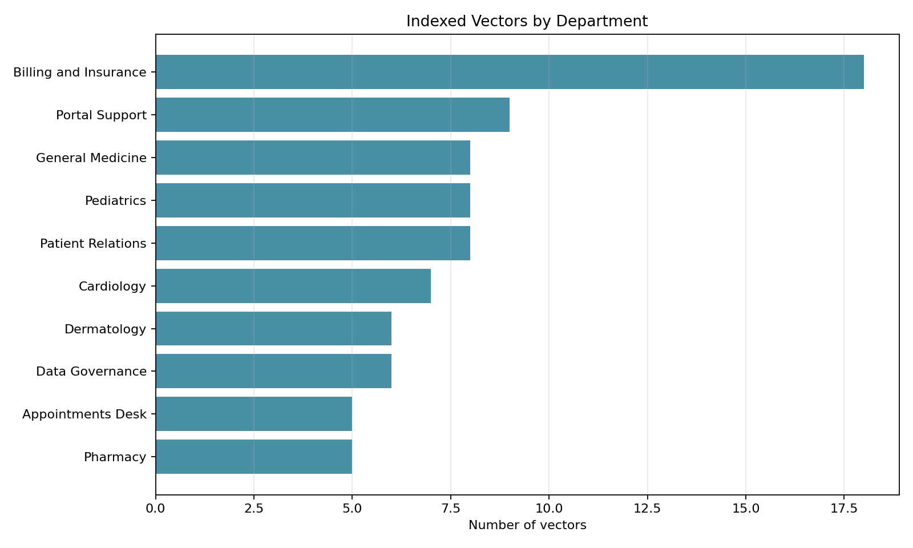
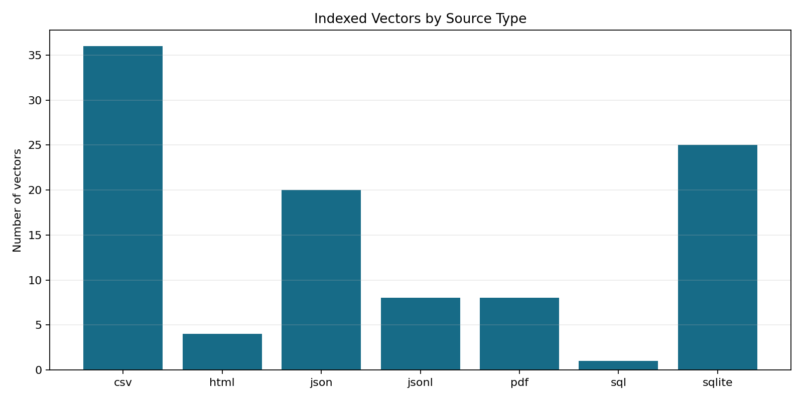

# Phase 6: Store Vector Index

**Project:** Hospital Patient Helpdesk Chatbot  
**Python module:** `04_embeddings/06_store_vector_index.py`  
**Jupyter notebook:** `13_notebooks/06_store_vector_index.ipynb`

## Purpose

Persist Phase 5 embeddings in a durable, queryable vector index while retaining
the exact chunk text, source provenance, retrieval metadata, checksums, model,
and vector dimension needed by the Phase 7 retriever.

## Backend Selection

The project originally allows ChromaDB or FAISS. Neither library is installed in
the active environment, so this implementation uses a portable SQLite exact
cosine backend named `sqlite_exact_cosine`. The database is stored under the
existing `05_vector_store/chroma_db/` directory to preserve the requested folder
structure, but the file is explicitly named `.sqlite3` and is not represented as
a Chroma database.

This backend provides deterministic local persistence, float32 vectors, exact
cosine ranking, SQL metadata filters, transactional writes, and integrity checks.
The module interface is backend-neutral so a ChromaDB adapter can replace it
later without changing Phase 4 or Phase 5 artifacts.

## Input Files

| Input | Required | Purpose |
|---|---|---|
| `01_data/processed/05_embeddings.json` | Yes | 384-dimensional vectors, IDs, checksums, model, and key metadata |
| `01_data/processed/04_enriched_chunks.json` | Yes | Exact text and complete retrieval metadata stored with each vector |

## Stored Vector Schema

| Field | Purpose |
|---|---|
| `chunk_id` | Primary key joining the index to upstream artifacts |
| `document_id` | Stable source-document identifier |
| `text` | Exact chunk returned to the retriever |
| `source_file`, `source_type` | Citation provenance |
| `department` | Filterable operational department |
| `content_category` | Filterable retrieval category |
| `model`, `dimension` | Query compatibility contract |
| `text_sha256` | Detects text/index mismatch |
| `metadata_json` | Complete Phase 4 retrieval metadata |
| `embedding` | Compact little-endian float32 vector blob |

## Code Section Guide

### 0. Notebook project discovery

The notebook's `find_project_root` helper searches the current directory, every
parent, and a `hospital_patient_helpdesk_chatbot` child at each level. A
candidate is accepted only when the Phase 6 module, Phase 5 embeddings, and
Phase 4 enriched chunks all exist. This allows Jupyter to start from the
workspace root, project root, or `13_notebooks` without constructing a duplicated
project path.

### 1. Load and validate inputs

`load_json_list` rejects missing or malformed artifacts. `validate_inputs`
requires one-to-one chunk IDs, one embedding model, one dimension, correct
vector lengths, and matching SHA-256 checksums.

### 2. Serialize vectors

`vector_to_blob` stores vectors as compact float32 bytes. `blob_to_vector`
reconstructs them for exact cosine search.

### 3. Create the index schema

`create_schema` creates index metadata, vector rows, and SQL indexes for
department, content category, and source type filters.

### 4. Build atomically

`build_index` writes a temporary SQLite database, commits all records, runs
`PRAGMA integrity_check`, explicitly closes the connection, and atomically
replaces the final index. A failed build therefore cannot leave a partial final
database.

### 5. Query the index

`query_index` validates query dimension, applies optional department/category
filters, decodes candidate vectors, computes cosine similarity, and returns the
highest-scoring chunks with text and metadata.

### 6. Validate persistence

`validate_index` checks record count, SQLite integrity, vector byte lengths, and
the checksum of every persisted text chunk.

### 7. Report and visualize

`run_index_storage` performs a smoke query, writes manifest/report/audit/failure
artifacts, and generates department and source-type composition plots.

## Running the Python Module

```bash
python 04_embeddings/06_store_vector_index.py
```

Custom locations:

```bash
python 04_embeddings/06_store_vector_index.py \
  --embeddings 01_data/processed/05_embeddings.json \
  --chunks 01_data/processed/04_enriched_chunks.json \
  --index-dir 05_vector_store/chroma_db \
  --output-dir 01_data/processed
```

## Output Files

| Output | Type | Purpose |
|---|---|---|
| `05_vector_store/chroma_db/06_vector_index.sqlite3` | SQLite | Persistent vector, text, and metadata index |
| `01_data/processed/06_vector_index_manifest.json` | JSON | Backend, model, dimension, count, metric, and filters |
| `01_data/processed/06_vector_index_report.json` | JSON | Inputs, size, smoke-query result, and artifact inventory |
| `01_data/processed/06_vector_index_audit.csv` | CSV | One traceability row per indexed vector |
| `01_data/processed/06_failed_index_records.json` | JSON | Records that could not be indexed |
| `01_data/processed/plots/06_vectors_by_department.png` | PNG | Top departments represented in the index |
| `01_data/processed/plots/06_vectors_by_source_type.png` | PNG | Indexed vector count by source format |

## Diagnostic Plots

### Vectors by department

This plot exposes department imbalance and confirms that operational areas are
available for filtered retrieval.



### Vectors by source type

This plot verifies coverage across CSV, HTML, JSON, JSONL, PDF, SQL, and SQLite
sources after persistence.



## Current Demonstration Result

| Metric | Result |
|---|---:|
| Input embeddings | 102 |
| Indexed vectors | 102 |
| Failed records | 0 |
| Dimension | 384 |
| Distance metric | Cosine similarity |
| Backend | `sqlite_exact_cosine` |

## Notebook and Python Module Differences

### `06_store_vector_index.ipynb`

- Provides an interactive, guided review of the Phase 6 contract.
- Resolves the project root safely from common Jupyter working directories.
- Shows input validation and backend information.
- Executes real unfiltered and department-filtered queries.
- Displays the report and diagnostic plots inline.
- Uses assertions for smoke testing and review.

### `06_store_vector_index.py`

- Owns schema creation and float32 vector serialization.
- Implements atomic rebuilds and SQLite integrity validation.
- Provides reusable exact cosine search and metadata filtering.
- Writes deterministic manifests, reports, audits, failures, and plots.
- Exposes a CLI for automated pipeline execution.

The notebook explains and inspects; the Python module is the reusable source of
truth.

## Safety and Limitations

- Index only synthetic or properly authorized hospital text.
- A vector index supports retrieval; it does not diagnose or recommend care.
- Exact search reads candidate vectors and is appropriate for this small corpus.
  Large production collections should use ChromaDB, FAISS, or another approved
  approximate-nearest-neighbor backend.
- Never mix vectors from different models or dimensions.
- Protect the database with the same access, retention, backup, and audit rules
  applied to its source documents.

## Next Step

Use `05_vector_store/chroma_db/06_vector_index.sqlite3` in
`06_rag_pipeline/07_retriever.py` or `13_notebooks/07_retriever.ipynb`.
