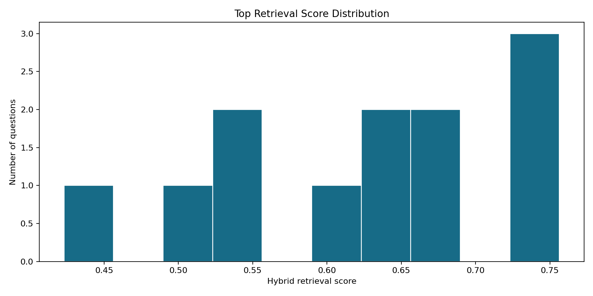
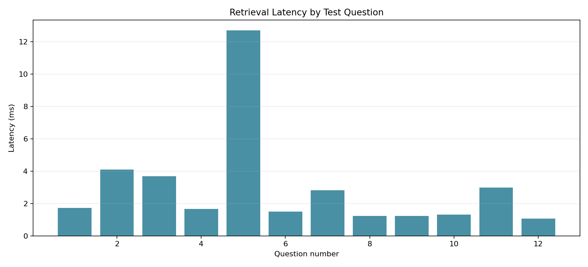

# Phase 7: Retriever

**Project:** Hospital Patient Helpdesk Chatbot  
**Python module:** `06_rag_pipeline/07_retriever.py`  
**Jupyter notebook:** `13_notebooks/07_retriever.ipynb`

## Purpose

Convert a patient's administrative question into a Phase 5-compatible query
vector, search the Phase 6 index, rerank candidates, and return grounded chunks
with citations, metadata, confidence, latency, filters, and safety-routing labels.

The retriever returns evidence only. It does not generate a patient-facing
answer, diagnose a condition, or recommend treatment or medication dosage.

## Input Files

| Input | Required | Purpose |
|---|---|---|
| `05_vector_store/chroma_db/06_vector_index.sqlite3` | Yes | Phase 6 vectors, text, checksums, and metadata |
| `01_data/sample_queries/test_questions.csv` | For evaluation | Questions, expected sources, categories, and safety classes |
| `04_embeddings/05_create_embeddings.py` | Yes | Exact query embedding implementation used for indexed chunks |
| `04_embeddings/06_store_vector_index.py` | Yes | Persistent cosine-query interface |

## Retrieval Flow

1. Validate the question and vector-index contract.
2. Create a 384-dimensional query vector with the Phase 5 model.
3. Infer a narrow category route only for unambiguous terms.
4. Request cosine candidates from the Phase 6 index.
5. Calculate query-token coverage for each candidate.
6. Blend normalized vector similarity and lexical coverage.
7. Return top-k evidence with sources, metadata, confidence, and safety labels.

## Category Routing

Transparent routes are applied for clear appointment, insurance, portal,
visitor, schedule, department-information, and clinical-safety wording. An
explicit caller-supplied filter overrides the inferred route. The active filter
is always returned in `RetrievalResponse.filters` for auditing.

## Result Schema

| Field | Description |
|---|---|
| `rank` | One-based final ranking |
| `chunk_id` | Stable index and source identifier |
| `text` | Grounding text passed to later prompt construction |
| `source_file`, `source_type` | Citation provenance |
| `department`, `content_category` | Filterable Phase 4 metadata |
| `vector_score` | Phase 6 cosine similarity |
| `lexical_score` | Fraction of informative query tokens present in the chunk |
| `final_score` | Weighted vector and lexical score |
| `metadata` | Complete retrieval metadata, including page references where available |

## Code Section Guide

### 0. Notebook project discovery

`find_project_root` searches the current directory, all parents, and a project
child at every level. It accepts a directory only when the Phase 7 module and
Phase 6 index exist, allowing Jupyter to start from the workspace, project, or
`13_notebooks` directory.

### 1. Configuration and dependency loading

`RetrieverConfig` validates top-k, candidate count, vector weight, and minimum
score. `load_dependencies` imports the exact Phase 5 and Phase 6 implementations.

### 2. Index compatibility

`load_index_contract` checks SQLite integrity and reads the model, dimension,
backend, and schema version. A query cannot proceed with an incompatible model.

### 3. Lexical reranking

`query_tokens` removes common words. `lexical_overlap` measures how completely
a candidate covers the informative query terms, improving exact policy, day,
department, and service matches.

### 4. Routing and safety labels

`infer_content_category` creates auditable metadata routes. `derive_safety_labels`
marks emergency or unsafe-medical-advice wording for later guardrails without
making a clinical interpretation.

### 5. Retrieval and confidence

`retrieve` embeds the question, searches candidates, calculates hybrid scores,
returns top-k results, and assigns cautious `high`, `medium`, `low`, or `none`
confidence based on score strength and separation.

### 6. Test-set evaluation

`run_retriever_evaluation` runs the bundled questions, checks expected sources,
records latency and confidence, isolates failures, writes artifacts, and creates
diagnostic plots.

## Running the Python Module

Run the bundled evaluation:

```bash
python 06_rag_pipeline/07_retriever.py
```

Run one question:

```bash
python 06_rag_pipeline/07_retriever.py \
  --question "How can I reschedule my appointment?" \
  --top-k 5
```

Apply an explicit filter:

```bash
python 06_rag_pipeline/07_retriever.py \
  --question "Where is the department?" \
  --department Cardiology \
  --category department_information
```

## Output Files

| Output | Type | Purpose |
|---|---|---|
| `01_data/processed/07_retrieval_results.json` | JSON | Full ranked responses for every test question |
| `01_data/processed/07_retrieval_report.json` | JSON | Source-hit rate, confidence counts, latency, and configuration |
| `01_data/processed/07_retrieval_audit.csv` | CSV | One review row per evaluated question |
| `01_data/processed/07_failed_queries.json` | JSON | Questions that could not be retrieved |
| `01_data/processed/plots/07_top_retrieval_score_distribution.png` | PNG | Distribution of top hybrid scores |
| `01_data/processed/plots/07_retrieval_latency_by_query.png` | PNG | End-to-end retrieval latency per question |

## Diagnostic Plots

### Top retrieval score distribution

The histogram shows whether the sample set produces consistently useful top
scores or a cluster of weak matches requiring corpus or embedding improvements.



### Retrieval latency by query

The latency chart includes query embedding, candidate search, reranking, and
response construction for each bundled question.



## Current Demonstration Result

| Metric | Result |
|---|---:|
| Test questions | 12 |
| Successful queries | 12 |
| Expected source in top 5 | 12 |
| Failed queries | 0 |
| Default top-k | 5 |
| Vector/lexical weights | 80% / 20% |

This bundled result is a development smoke test, not a substitute for the larger
retrieval evaluation performed in Phase 17.

## Notebook and Python Module Differences

### `07_retriever.ipynb`

- Resolves paths safely from common Jupyter working directories.
- Demonstrates contract validation and a single ranked response.
- Shows explicit metadata filtering and safety-routing labels.
- Executes the complete test set with assertions.
- Displays reports and plots inline for human review.

### `07_retriever.py`

- Owns query embedding compatibility and index access.
- Implements category routing, lexical reranking, confidence, and safety labels.
- Provides reusable `retrieve` and evaluation functions.
- Writes all numbered artifacts and plots.
- Exposes CLI modes for one question or full evaluation.

The notebook explains and inspects; the Python module remains the production
source of truth.

## Safety and Limitations

- Safety labels are routing signals, not diagnoses or risk scores.
- Low retrieval confidence must not be presented as a grounded answer.
- Source snippets may contain operational healthcare information but do not
  authorize diagnosis, treatment, or dosage recommendations.
- The local hashing embedder is a reproducible baseline; Phase 17 must test
  retrieval quality before production use.
- Real patient questions and logs require approved privacy and retention controls.

## Next Step

Pass `RetrievalResponse.results` to `06_rag_pipeline/08_prompt_template.py` or
`13_notebooks/08_prompt_template.ipynb` to construct a grounded prompt with
citations and safety instructions.
