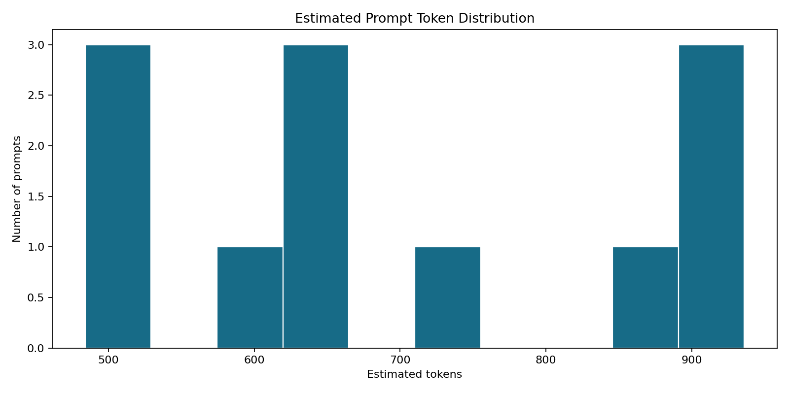
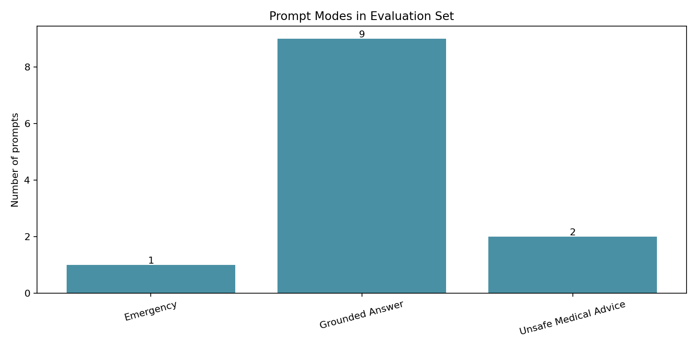

# Phase 8: Prompt Template

**Project:** Hospital Patient Helpdesk Chatbot  
**Python module:** `06_rag_pipeline/08_prompt_template.py`  
**Jupyter notebook:** `13_notebooks/08_prompt_template.ipynb`

## Purpose

Convert Phase 7 retrieval responses into structured, healthcare-safe prompt
messages for the Phase 9 LLM client. Each prompt preserves its question,
citations, source provenance, retrieval confidence, safety labels, context size,
and active response mode.

## Input Files

| Input | Required | Purpose |
|---|---|---|
| `01_data/processed/07_retrieval_results.json` | Yes | Questions, ranked evidence, confidence, filters, and safety labels |
| `02_config/prompt_config.yaml` | Yes | Core system policy and insufficient-context message |

## Prompt Modes

| Mode | Behavior |
|---|---|
| `grounded_answer` | Answer only from evidence and cite factual claims |
| `insufficient_context` | State that verified information is unavailable and route to staff |
| `emergency` | Immediately advise contacting local emergency services; do not diagnose |
| `unsafe_medical_advice` | Refuse diagnosis, treatment, medication choice, and dosage advice |

Emergency mode has the highest priority. Unsafe-medical-advice mode is selected
next. Grounded mode is used only when evidence and confidence meet the configured
minimum.

## Prompt Bundle Schema

| Field | Description |
|---|---|
| `prompt_id`, `prompt_version` | Stable prompt identity and contract version |
| `mode` | Active safety and response mode |
| `question` | Normalized patient question |
| `system_prompt` | Hospital policy, injection defenses, and mode instructions |
| `user_prompt` | Question, delimited sources, and response request |
| `sources` | Citation labels, IDs, files, pages, scores, and source text |
| `retrieval_confidence` | Phase 7 confidence label |
| `safety_labels` | Emergency or unsafe-advice routing labels |
| `context_characters` | Included evidence size |
| `estimated_prompt_tokens` | Conservative character-based token estimate |

## Prompt Injection Defense

Retrieved documents are wrapped inside `<source>` blocks and explicitly declared
untrusted evidence. The system message instructs the model to ignore source text
that attempts to change rules, reveal secrets, invoke outside knowledge, or act
as system instructions. Sources remain usable as factual evidence only.

## Code Section Guide

### 0. Notebook project discovery

`find_project_root` supports Jupyter running from the workspace root, project
root, or `13_notebooks`. A candidate must contain the Phase 8 module, Phase 7
results, and prompt configuration.

### 1. Configuration and input validation

`PromptConfig` validates source and context budgets. `load_prompt_settings`
validates the YAML policy. `load_retrieval_responses` validates the Phase 7
response schema.

### 2. Mode selection

`select_mode` applies emergency-first routing, then unsafe medical advice,
insufficient context, and finally grounded answering.

### 3. Source budgeting and citations

`build_sources` selects up to five chunks and enforces the character budget.
`page_reference` formats PDF page ranges. `citation_header` creates stable `[S#]`
labels with source file, page, department, category, and retrieval score.

### 4. Delimited context rendering

`clean_context_text` removes unsafe control characters without rewriting source
content. `render_context` wraps evidence in explicit source boundaries.

### 5. Mode-specific instructions

`response_rules` defines grounded, insufficient-context, emergency, and unsafe
medical-advice behavior. `build_prompt` combines these rules with the hospital
system policy, source evidence, and patient question.

### 6. Validation

`validate_prompt` checks source and character budgets, required safety language,
citation presence, emergency routing, and dosage-refusal instructions.

### 7. Batch reporting and plots

`run_prompt_build` creates all prompt bundles, isolates failures, writes an audit
and report, and generates prompt-size and mode-distribution diagnostics.

## Running the Python Module

```bash
python 06_rag_pipeline/08_prompt_template.py
```

Custom budgets:

```bash
python 06_rag_pipeline/08_prompt_template.py \
  --retrieval-results 01_data/processed/07_retrieval_results.json \
  --prompt-config 02_config/prompt_config.yaml \
  --max-sources 5 \
  --max-context-characters 6000
```

## Output Files

| Output | Type | Purpose |
|---|---|---|
| `01_data/processed/08_prompt_bundles.json` | JSON | Complete system/user messages and citation provenance |
| `01_data/processed/08_prompt_report.json` | JSON | Counts, modes, token estimates, configuration, and outputs |
| `01_data/processed/08_prompt_audit.csv` | CSV | One compact review row per prompt |
| `01_data/processed/08_failed_prompts.json` | JSON | Retrieval responses that could not produce a valid prompt |
| `01_data/processed/plots/08_prompt_token_estimate_distribution.png` | PNG | Prompt-size distribution |
| `01_data/processed/plots/08_prompt_modes.png` | PNG | Number of prompts in each active mode |

## Diagnostic Plots

### Prompt token estimates

This plot supports context-window planning and cost monitoring. Estimates use a
conservative four-characters-per-token approximation and are not provider bills.



### Prompt modes

This chart verifies how many test questions use grounded, emergency, or
unsafe-medical-advice instructions.



## Current Demonstration Result

| Metric | Result |
|---|---:|
| Input retrieval responses | 12 |
| Prompts created | 12 |
| Failed prompts | 0 |
| Grounded prompts | 9 |
| Emergency prompts | 1 |
| Unsafe-medical-advice prompts | 2 |
| Maximum sources | 5 |
| Context budget | 6,000 characters |

## Notebook and Python Module Differences

### `08_prompt_template.ipynb`

- Resolves paths safely from common Jupyter working directories.
- Demonstrates grounded, emergency, unsafe-advice, and insufficient modes.
- Previews citation-ready prompt messages.
- Executes batch validation with assertions.
- Displays prompt-size and mode plots inline.

### `08_prompt_template.py`

- Owns prompt schemas, YAML loading, modes, and source budgets.
- Implements citation and page-reference formatting.
- Adds prompt-injection defenses and healthcare safety rules.
- Validates prompt structure and mode-specific requirements.
- Writes numbered artifacts, reports, audits, failures, and plots.
- Exposes a CLI for automated pipeline execution.

The notebook explains and inspects; the Python module remains the production
source of truth.

## Safety and Limitations

- Prompt rules reduce risk but cannot replace Phase 11 output guardrails.
- Retrieved evidence may be incomplete, stale, or conflicting; the model must not
  fill gaps from unsupported knowledge.
- Emergency mode must prioritize immediate emergency routing over explanation.
- Medication and diagnosis requests must be redirected to qualified clinicians
  or pharmacists.
- Real patient text requires approved privacy, logging, and retention controls.

## Next Step

Send the structured messages in `08_prompt_bundles.json` to
`06_rag_pipeline/09_llm_client.py` or `13_notebooks/09_llm_client.ipynb`, while
preserving prompt mode, citations, confidence, and safety labels.
